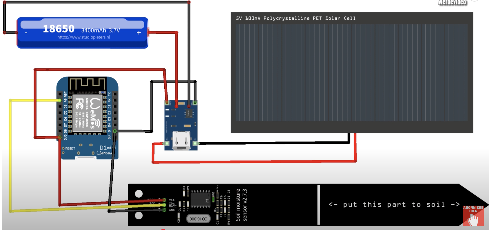
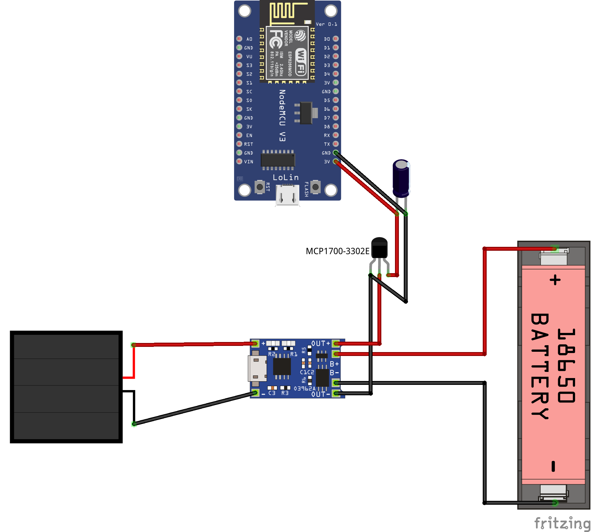

# Pflanzensensor mit ESP8266 und MQTT


Dieses Projekt zeigt, wie du einen smarten Pflanzensensor mit einem ESP8266 D1 Mini, einem kapazitiven Bodenfeuchtigkeitssensor, einem Solarpanel und einer MQTT-Schnittstelle entwickelst.
Der Sensor misst die Bodenfeuchtigkeit und die Akku-Spannung und sendet diese Werte über MQTT an einen Broker.

## 🚀 **Features**
- Messung der Bodenfeuchtigkeit mit einem Capacitive Soil Moisture Sensor v1.2
- Überwachung der Akku-Spannung zur Energieverwaltung
- MQTT-Integration zur Datenübertragung
- Solarbetrieb mit Energiesparmodus (Deep Sleep) für längere Laufzeit


## 🔧 **Verwendete Komponenten**
- [ESP8266 D1 Mini Lite](https://www.wemos.cc/en/latest/d1/d1_mini_lite.html)
- Capacitive Soil Moisture Sensor v1.2
- HW-107 Lade- und Schutzmodul
- 3.7V Li-Ion Akku (3000 mAh)
- Solarpanel


## 🏠 **3D-Gehäuse**
STL Datei erstellt mit: https://www.tinkercad.com/dashboard

STL Viewer: https://www.viewstl.com/

STL Drucker: https://3d-druckexpress.de/product-category

---

## 🔨 **Installation und Einrichtung**
### 1. **Voraussetzungen**
- ESPHome installiert (lokal oder über Home Assistant)
- MQTT-Broker (z.B. Mosquitto)
- Treiber heruntergeladen (https://www.wemos.cc/en/latest/ch340_driver.html)
- Arduino IDE (https://www.arduino.cc/en/software)

### 2. **ESPHome Konfiguration**
Die Datei `pflanzensensor.yaml` enthält die Konfiguration für ESPHome. Stelle sicher, dass du deine WLAN- und MQTT-Zugangsdaten (von HA) einträgst.

```yaml
wifi:
  ssid: "DEIN_SSID"
  password: "DEIN_PASSWORT"

mqtt:
  broker: "DEIN_MQTT_BROKER"
  username: "DEIN_MQTT_USER"
  password: "DEIN_MQTT_PASS"
```

### 3. **Flashen des ESP8266 über ESP Home**
Verbinde den D1 Mini erstmals über USB mit HA:
https://esphome.io/guides/getting_started_hassio.html
Lade dann die Datei `pflanzensensor.yaml` über ESP Home hoch.

---

## 📊 **MQTT Integration**
Die Sensordaten können über folgende Topics abgerufen werden:
- Bodenfeuchtigkeit: `pflanzensensor/sensor/bodenfeuchtigkeit/state`
- Akku-Spannung: `pflanzensensor/sensor/akku-spannung/state`

Diese lassen sich einfach in Home Assistant oder anderen MQTT-Clients visualisieren.

---
## **Betriebs-Möglichkeiten**

### 1. Möglichkeit:
   
**Vorteile**
+ Batteriemessung möglich

**Nachteil:**
- keine konstanten 3.3V -> Werte sind abhängig von der Batteriespannung
  
  

### 2. Möglichkeit:
   
**Vorteile**
+ konstante 3.3V ohne Beeinflussung auf den Sensor
  
**Nachteile:**
- keine Batteriemessung möglich

  
  
Anleitung basiert auf: https://tutorials-raspberrypi.de/nodemcu-esp8266-solar-zelle-18650-akku-stromversorgung/

---

## 🔌 **Schaltplan und Verkabelung**
Die folgende Grafik zeigt die vollständige Verdrahtung des Pflanzensensors:

### **Verbindungen:**
1. **Capacitive Soil Moisture Sensor**
   - VCC → 3.3V am D1 Mini
   - GND → GND am D1 Mini
   - AOUT → A0 am D1 Mini

2. **HW-107 Lade- und Schutzmodul**
   - OUT+ → 5V am D1 Mini
   - OUT- → GND am D1 Mini
   - BAT+ → Pluspol vom Akku
   - BAT- → Minuspol vom Akku
   - IN+ → Pluspol vom Solarpanel
   - IN- → Minuspol vom Solarpanel

---

## 📡 **Datenfluss und MQTT-Kommunikation**
Der ESP8266 misst die Feuchtigkeit und Akku-Spannung und sendet diese Daten per MQTT an den Broker. Von dort aus können sie in Home Assistant oder anderen Smart-Home-Plattformen abgerufen werden.


---

## 🔋 **Deep Sleep für Energieeinsparung**
Durch den Einsatz von Deep Sleep wird der Stromverbrauch drastisch gesenkt. In der Konfiguration ist der Sensor 60 Sekunden aktiv und schläft dann 15 Minuten.

---

## 📅 **To-Do und Weiterentwicklung**
- Optimierung der Energieeffizienz
- Integration weiterer Sensoren (z.B. Temperatur, Licht)

---

## 📜 **Lizenz**
Dieses Projekt steht unter der MIT-Lizenz.

## 🙏 **Danksagungen**
- Inspiration durch die Maker-Community und ESPHome-Community.

